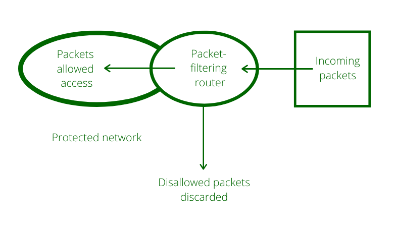

<a name="readme-top"></a>

<!-- PROJECT LOGO -->
<br />
<div align="center">
  <a href="https://github.com/kudzaiprichard/realestate-backend">
    
  </a>

  <h3 align="center">Firewall `packet filter`</h3>

  <p align="center">
    A simple python packet filtering firewall
    <br />
  </p>
  <br/>
</div>

<!-- TABLE OF CONTENTS -->
<details>
  <summary>Table of Contents</summary>
  <ol>
    <li>
      <a href="#about-the-project">About The Project</a>
      <ul>
        <li><a href="#project-scope">Project Scope</a></li>
        <li><a href="#project-design">Project Design</a></li>
        <li><a href="#built-with">Built With</a></li>
      </ul>
    </li>
    <li>
      <a href="#getting-started">Getting Started</a>
      <ul>
        <li><a href="#prerequisites">Prerequisites</a></li>
        <li><a href="#installation">Installation</a></li>
        <li><a href="#contributing">Contributing</a></li>
      </ul>
    </li>
    <li><a href="#license">License</a></li>
    <li><a href="#contact">Contact</a></li>
    <li><a href="#acknowledgments">Acknowledgments</a></li>
  </ol>
</details>

<!-- ABOUT THE PROJECT -->
# About The Project

### Project Scope

A packet filtering firewall is a network security technique that regulates data flow to and from a network. 
It is a security mechanism that allows packets to move across networks while controlling their flow through the use of 
a set of rules, protocols, IP addresses, and ports.

* User should be able to set rules on which IP addresses and port numbers to be blocked or allowed
* System should be able to log blocked or allowed IP addresses and port numbers

## Project Design

### Architecture


> Above diagram shows the packet filtering firewall architecture

The firewall acts as a guard. It guards a corporate network acting as a shield between the inside network and the outside world. 
All the traffic in either direction must pass through the firewall. It then decides whether the traffic is allowed to flow or not. 
The firewall can be implemented as hardware and software, or a combination of both.



* It works in the network layer of the OSI Model. It applies a set of rules (based on the contents of IP and transport header fields) 
  on each packet and based on the outcome, decides to either forward or discard the packet.
* Packet filter firewall controls access to packets on the basis of packet source and destination address or specific transport protocol type. 
  It is done at the OSI (Open Systems Interconnection) data link, network, and transport layers. 
  Packet filter firewall works on the network layer of the OSI model.
* Packet filters consider only the most basic attributes of each packet, and they don’t need to remember anything about 
  the traffic since each packet is examined in isolation. For this reason, they can decide packet flow very quickly.

> Example: Filter can be set to block all UDP segments and all Telnet connections. 
    This type of configuration prevents outsiders from logging onto internal hosts using Telnet and insider from logging 
    onto external hosts using Telnet connections.

### Built With
Wrote the firewall using `python3`

<div>
<a href="https://www.python.org/" title="Python"></a>
</div>


<p align="right">(<a href="#readme-top">back to top</a>)</p>

<!-- GETTING STARTED -->
## Getting Started

### Prerequisites

You should have the below software installed in your pc :
* python3
* and your preferred IDE or text editor


### Installation

1. Get a free API Key at [https://github.com/settings/tokens](https://github.com/settings/tokens)
2. Clone the repo

   ```sh
   git clone https://github.com/kudzaiprichard/python-packet-filter-firewall
   ```

3. Open project in IDE or text editor

<p align="right">(<a href="#readme-top">back to top</a>)</p>


<!--CONTRIBUTING-->
## Contributing

If you have a suggestion that would make this better, please fork the repo and create a pull request. You can also simply open an issue with the tag "enhancement".
Don't forget to give the project a star! Thanks again!

1. Fork the Project
2. Create your Feature Branch (`git checkout -b feature/AmazingFeature`)
3. Commit your Changes (`git commit -m 'Add some AmazingFeature'`)
4. Push to the Branch (`git push origin feature/AmazingFeature`)
5. Open a Pull Request

### :fire: Contribution

Your contributions are always welcome and appreciated. Following are the things you can do to contribute to this project.

1. **Report a bug** <br>
   If you think you have encountered a bug, and I should know about it, feel free to report it [here]() and I will take care of it.

2. **Request a feature** <br>
   You can also request for a feature [here](), and if it will viable, it will be picked for development.

3. **Create a pull request** <br>
   It can't get better than this, your pull request will be appreciated by the community. You can get started by picking up any open issues from [here]() and make a pull request.

> If you are new to open-source, make sure to check read more about it [here](https://www.digitalocean.com/community/tutorial_series/an-introduction-to-open-source) and learn more about creating a pull request [here](https://www.digitalocean.com/community/tutorials/how-to-create-a-pull-request-on-github).

<p align="right">(<a href="#readme-top">back to top</a>)</p>


<!-- LICENSE -->
## License

> Distributed under the MIT License. See `LICENSE.txt` for more information.

<p align="right">(<a href="#readme-top">back to top</a>)</p>


<!-- CONTACT -->
## Contact

> Kudzai P Matizirofa - [linkedin.com/in/kudzai-prichard](https://linkedin.com/in/kudzai-prichard) - <kudzaiprichard@gmail.com>

Project Link: [https://github.com/kudzaiprichard/python-packet-filter-firewall](https://github.com/kudzaiprichard/python-packet-filter-firewall)

<p align="right">(<a href="#readme-top">back to top</a>)</p>

<!-- ACKNOWLEDGMENTS -->
## Acknowledgments

list of resources I found helpful and would like to give credit to.

* [Choose an Open Source License](https://choosealicense.com)
* [Packet Filter Firewall](https://www.geeksforgeeks.org/types-of-firewall-and-possible-attacks/)
* [Python Documentation](https://docs.python.org/3/)
* [GitHub Pages](https://pages.github.com)
* [Scapy docs](https://scapy.readthedocs.io/en/latest/)

<p align="right">(<a href="#readme-top">back to top</a>)</p>

